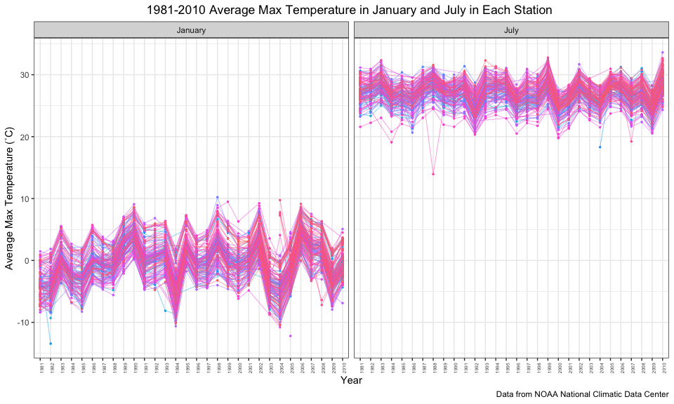

p8105\_hw3\_zf2212
================
Catherine
10/12/2018

Problem 1 BRFSS
---------------

First, do some data cleaning:

``` r
# import
data("brfss_smart2010")
# clean
brfss = brfss_smart2010 %>% 
  janitor::clean_names() %>% # use appropriate variable names
  filter(topic == "Overall Health") %>% # filter topic 
  filter(response %in% c("Excellent", "Very good", "Good", "Fair", "Poor"), !is.na("response")) %>% 
  # filter response from excellent to poor
  mutate(response, response = as.factor(response)) %>% 
  arrange(response) %>%  # mutate response as factor and arrange order
  select(year, locationabbr, locationdesc, response, data_value, everything())
```

### 1.1

In 2002, which states were observed at 7 locations?

``` r
# filter the 2002 data
brfss2002 = brfss %>% 
  filter(year == 2002)
# summarize the number of locations
n_obs2002 = brfss2002 %>% 
  group_by(locationabbr) %>% 
  summarize(n_location = n_distinct(locationdesc)) 
# find the state observed 7 location
obs7 = n_obs2002 %>% 
  filter(n_location == 7) 
obs7[1]
```

    ## # A tibble: 3 x 1
    ##   locationabbr
    ##   <chr>       
    ## 1 CT          
    ## 2 FL          
    ## 3 NC

There are three states were observed at 7 locations, including **CT, FL and NC.**

### 1.2

Make a “spaghetti plot” that shows the number of locations in each state from 2002 to 2010.

``` r
# arrange the data
brfss_nloc = brfss %>%
  group_by(year, locationabbr) %>% 
  summarize(n_loc = n_distinct(locationdesc))
# create the plot
brfss_nloc %>% 
  ggplot(aes(x = year, y = n_loc, color = locationabbr )) + 
  geom_point(size = 0.8) +
  geom_line(size = 0.5) +
  labs(
    title = "2002-2010 Number of Locations Observed in Each States",
    x = "Year",
    y = "Number of Locations",
    caption = "Data from the data.gov") + 
  scale_color_hue(name = "States") +
  theme_bw() +
  theme(legend.position = "bottom", plot.title = element_text(hjust = 0.5), legend.text = element_text(size = 7)) +
  guides(col = guide_legend(nrow = 3))
```


### 1.3

Make a table showing, for the years 2002, 2006, and 2010, the mean and standard deviation of the proportion of “Excellent” responses across locations in NY State.

``` r
# filter ny data
brfss_ny = brfss %>% 
  filter(year == 2002 | year == 2006 | year == 2010, locationabbr == "NY", response == "Excellent")  %>% 
  select(year, locationabbr, locationdesc, response, data_value) %>% 
  spread(key = "response", value = "data_value") %>% 
  group_by(year) %>% # group data by year
  janitor::clean_names()  %>% 
  summarize(excellent_mean = mean(excellent, na.rm = TRUE), 
            excellent_sd = sd(excellent, na.rm = TRUE)) # summarize mean and sd
brfss_ny 
```

    ## # A tibble: 3 x 3
    ##    year excellent_mean excellent_sd
    ##   <int>          <dbl>        <dbl>
    ## 1  2002           24.0         4.49
    ## 2  2006           22.5         4.00
    ## 3  2010           22.7         3.57

### 1.4

For each year and state, compute the average proportion in each response category (taking the average across locations in a state). Make a five-panel plot that shows, for each response category separately, the distribution of these state-level averages over time. (five-panel plot - facet\_grid() )

``` r
# arrange the data 
brfss_average = brfss %>% 
  group_by(year, locationabbr) %>% 
  select(year, locationabbr, locationdesc, response, data_value) %>% 
  spread(key = "response", value = "data_value") %>% 
  janitor::clean_names() %>% # compute the average proportion
  summarize(excellent_average = mean(excellent, na.rm = TRUE),
            fair_average = mean(fair, na.rm = TRUE),
            good_average = mean(good, na.rm = TRUE),
            poor_average = mean(poor, na.rm = TRUE),
            very_good_ave = mean(very_good, na.rm = TRUE)) 
brfss_average
```

    ## # A tibble: 443 x 7
    ## # Groups:   year [?]
    ##     year locationabbr excellent_avera… fair_average good_average
    ##    <int> <chr>                   <dbl>        <dbl>        <dbl>
    ##  1  2002 AK                       27.9         8.6          23.8
    ##  2  2002 AL                       18.5        12.1          32.7
    ##  3  2002 AR                       24.1        12.5          29.9
    ##  4  2002 AZ                       24.1         8.9          29.4
    ##  5  2002 CA                       22.7        14.3          28.7
    ##  6  2002 CO                       23.1        11.2          30.3
    ##  7  2002 CT                       29.1         8.73         25.0
    ##  8  2002 DC                       29.3         8.3          28.1
    ##  9  2002 DE                       20.9        11.1          29.8
    ## 10  2002 FL                       25.7         9.67         28.9
    ## # ... with 433 more rows, and 2 more variables: poor_average <dbl>,
    ## #   very_good_ave <dbl>

``` r
# arrange data for the plot
average_plot = 
  brfss_average %>% 
  group_by(year, locationabbr) %>% 
  gather(key = "response", value = "propotion", excellent_average:very_good_ave)

# set up a lookup table for the plot
fivepanel = c(excellent_average = "Excellent",
              fair_average = "Fair",
              good_average = "Good",
              poor_average = "Poor",
              very_good_ave = "Very Good")

# make fivepanel plot
average_plot %>% 
ggplot(aes(x = year , y = propotion, color = locationabbr)) +
  geom_point(size = 0.5) + 
  geom_line(size = 0.3) +
  facet_grid(~response, labeller = labeller(response = fivepanel)) +
  labs(
    title = "2002-2010 Distribution of Response Proportion Mean at State-level",
    x = "Year",
    y = "Response Proportiaon Mean",
    caption = "Data from data.gov") + 
  scale_color_hue(name = "States") +
  theme_bw() +
  theme(legend.position = "bottom", plot.title = element_text(hjust=0.5), legend.text = element_text(size = 7)) +
  guides(col = guide_legend(nrow = 3))
```


Problem 2 Instacart
-------------------

### 2.1

Write a short description of the dataset, noting the size and structure of the data, describing some key variables, and giving illstrative examples of observations.

``` r
# import and clean
data("instacart")
instacart %>% 
  janitor::clean_names()
```

    ## # A tibble: 1,384,617 x 15
    ##    order_id product_id add_to_cart_ord… reordered user_id eval_set
    ##       <int>      <int>            <int>     <int>   <int> <chr>   
    ##  1        1      49302                1         1  112108 train   
    ##  2        1      11109                2         1  112108 train   
    ##  3        1      10246                3         0  112108 train   
    ##  4        1      49683                4         0  112108 train   
    ##  5        1      43633                5         1  112108 train   
    ##  6        1      13176                6         0  112108 train   
    ##  7        1      47209                7         0  112108 train   
    ##  8        1      22035                8         1  112108 train   
    ##  9       36      39612                1         0   79431 train   
    ## 10       36      19660                2         1   79431 train   
    ## # ... with 1,384,607 more rows, and 9 more variables: order_number <int>,
    ## #   order_dow <int>, order_hour_of_day <int>,
    ## #   days_since_prior_order <int>, product_name <chr>, aisle_id <int>,
    ## #   department_id <int>, aisle <chr>, department <chr>

``` r
# decribe data
names(instacart) # variables name
```

    ##  [1] "order_id"               "product_id"            
    ##  [3] "add_to_cart_order"      "reordered"             
    ##  [5] "user_id"                "eval_set"              
    ##  [7] "order_number"           "order_dow"             
    ##  [9] "order_hour_of_day"      "days_since_prior_order"
    ## [11] "product_name"           "aisle_id"              
    ## [13] "department_id"          "aisle"                 
    ## [15] "department"

``` r
dim(instacart) # size
```

    ## [1] 1384617      15

``` r
head(instacart, 5) 
```

    ## # A tibble: 5 x 15
    ##   order_id product_id add_to_cart_ord… reordered user_id eval_set
    ##      <int>      <int>            <int>     <int>   <int> <chr>   
    ## 1        1      49302                1         1  112108 train   
    ## 2        1      11109                2         1  112108 train   
    ## 3        1      10246                3         0  112108 train   
    ## 4        1      49683                4         0  112108 train   
    ## 5        1      43633                5         1  112108 train   
    ## # ... with 9 more variables: order_number <int>, order_dow <int>,
    ## #   order_hour_of_day <int>, days_since_prior_order <int>,
    ## #   product_name <chr>, aisle_id <int>, department_id <int>, aisle <chr>,
    ## #   department <chr>

``` r
tail(instacart, 5)
```

    ## # A tibble: 5 x 15
    ##   order_id product_id add_to_cart_ord… reordered user_id eval_set
    ##      <int>      <int>            <int>     <int>   <int> <chr>   
    ## 1  3421063      14233                3         1  169679 train   
    ## 2  3421063      35548                4         1  169679 train   
    ## 3  3421070      35951                1         1  139822 train   
    ## 4  3421070      16953                2         1  139822 train   
    ## 5  3421070       4724                3         1  139822 train   
    ## # ... with 9 more variables: order_number <int>, order_dow <int>,
    ## #   order_hour_of_day <int>, days_since_prior_order <int>,
    ## #   product_name <chr>, aisle_id <int>, department_id <int>, aisle <chr>,
    ## #   department <chr>

``` r
skimr::skim(instacart) # look at the data
```

    ## Skim summary statistics
    ##  n obs: 1384617 
    ##  n variables: 15 
    ## 
    ## ── Variable type:character ─────────────────────────────────────────────────────
    ##      variable missing complete       n min max empty n_unique
    ##         aisle       0  1384617 1384617   3  29     0      134
    ##    department       0  1384617 1384617   4  15     0       21
    ##      eval_set       0  1384617 1384617   5   5     0        1
    ##  product_name       0  1384617 1384617   3 159     0    39123
    ## 
    ## ── Variable type:integer ───────────────────────────────────────────────────────
    ##                variable missing complete       n       mean        sd p0
    ##       add_to_cart_order       0  1384617 1384617       8.76      7.42  1
    ##                aisle_id       0  1384617 1384617      71.3      38.1   1
    ##  days_since_prior_order       0  1384617 1384617      17.07     10.43  0
    ##           department_id       0  1384617 1384617       9.84      6.29  1
    ##               order_dow       0  1384617 1384617       2.7       2.17  0
    ##       order_hour_of_day       0  1384617 1384617      13.58      4.24  0
    ##                order_id       0  1384617 1384617 1706297.62 989732.65  1
    ##            order_number       0  1384617 1384617      17.09     16.61  4
    ##              product_id       0  1384617 1384617   25556.24  14121.27  1
    ##               reordered       0  1384617 1384617       0.6       0.49  0
    ##                 user_id       0  1384617 1384617   1e+05     59487.15  1
    ##     p25     p50     p75    p100     hist
    ##       3       7      12      80 ▇▃▁▁▁▁▁▁
    ##      31      83     107     134 ▃▇▃▃▇▅▅▆
    ##       7      15      30      30 ▂▅▃▃▁▂▁▇
    ##       4       8      16      21 ▃▇▂▁▂▆▁▃
    ##       1       3       5       6 ▇▅▃▃▁▃▅▅
    ##      10      14      17      23 ▁▁▃▇▇▇▅▂
    ##  843370 1701880 2568023 3421070 ▇▇▇▇▇▇▇▇
    ##       6      11      21     100 ▇▂▁▁▁▁▁▁
    ##   13380   25298   37940   49688 ▆▆▇▇▇▆▇▇
    ##       0       1       1       1 ▆▁▁▁▁▁▁▇
    ##   51732   1e+05  154959  206209 ▇▇▇▇▇▇▇▇

``` r
instacart %>% # find unique users numbers
  distinct(user_id) %>% 
  nrow()
```

    ## [1] 131209

**Description**

The dataset originally comes from *instacart.com*. The version we used for this analysis is cleaned version from p8105.datasets. There are 1384617, 15 (observations, variables) in the dataset. Each row in the dataset is a product from an order and a single order per user. There are 131,209 unique users.

The variables include information of order\_id, product\_id, add\_to\_cart\_order, reordered, user\_id, eval\_set, order\_number, order\_dow, order\_hour\_of\_day, days\_since\_prior\_order, product\_name, aisle\_id, department\_id, aisle, department. There are no missing value in each column.

For the following analysis, the variables of interest includes **aisle, product\_name and department** as they are some key information for us to figure out the shopping behaviors of the users in *Instacart*.

In **reordered**, 1 represent this prodcut has been ordered by this user in the past and 0 represents it was not ordered before. For example, for *order\#1*, four out of eight products were reordered products.

In **order\_dow**, the numbers in the column show the day of the week on which the order was placed. As information about the start day of the week is not shown, we assume the first day of the week is Sunday, which means 0 represents Sunday.

### 2.2

How many aisles are there, and which aisles are the most items ordered from?

``` r
# make table of aisle 
aisles_data = instacart %>% 
  select(order_id, product_id, user_id, aisle_id, aisle, department) %>% 
  group_by(aisle, aisle_id, department) %>% 
  summarize(items_n = n()) %>% 
  arrange(desc(items_n)) 
# count the number of aisles
n_aisles = nrow(aisles_data)
# find aisles that most items ordered from
aisles_data[1,1]
```

    ## # A tibble: 1 x 1
    ##   aisle           
    ##   <chr>           
    ## 1 fresh vegetables

There are **134** aisles and **fresh vegetables** is the aisle which the most items ordered from.

### 2.3

Make a plot that shows the number of items ordered in each aisle. Order aisles sensibly, and organize your plot so others can read it.

``` r
# arrange data for the plot
aisles_plot = instacart %>% 
  select(aisle_id, aisle) %>% 
  group_by(aisle) %>% 
  summarize(items_n = n())
  
# make the plot
aisles_plot %>% 
  ggplot(aes(x = reorder(aisle, -items_n), y = items_n, fill = aisle)) + # set the axis
  geom_bar(stat = "identity") + 
  labs(title = "The Number of Items in Each Aisle",
       x = "Aisle",
       y = "Number of Items",
       caption = "Data from instacart.com") + 
  coord_flip() + # flip x and y
  scale_y_continuous(breaks = c(0,5000,10000,75000,100000,150000), expand = c(0, 1000)) + # reset the breaks
  theme_bw() +
  theme(text = element_text(size = 6), plot.title = element_text(hjust = 0.5), legend.position = "hide", title = element_text(size = 10, face = 'bold')) # set theme
```


As the number of each item range from 287 to 150609, which is very big, I break the Number of Items manually to make it clear. Also, differentiate each aisle by color. Instead of keeping the legend, I hided it and flip the x and y axis, which creats more space for the name of each aisle. It is easier to look compared to check the legend. By reordering the bars, max and min value are easy to read.

### 2.4

Make a table showing the most popular item in each of the aisles “baking ingredients”, “dog food care”, and “packaged vegetables fruits”. -- one table, showing one item from each of these three aisles.

``` r
# count the buying times of each product
popitem = instacart %>% 
  filter(aisle == "baking ingredients" | aisle == "dog food care" | aisle == "packaged vegetables fruits") %>% 
  group_by(aisle, product_name) %>% 
  summarize(times = n()) 
# fine most popular in each aisle
baking = popitem %>% 
  filter(aisle == "baking ingredients") %>% 
  arrange(desc(times)) 
  
dfc = popitem %>% 
  filter(aisle == "dog food care") %>% 
  arrange(desc(times)) 

pkvege = popitem %>% 
  filter(aisle == "packaged vegetables fruits") %>% 
  arrange(desc(times))

# create table
rbind(baking[1,], dfc[1,], pkvege[1,])
```

    ## # A tibble: 3 x 3
    ## # Groups:   aisle [3]
    ##   aisle                    product_name                              times
    ##   <chr>                    <chr>                                     <int>
    ## 1 baking ingredients       Light Brown Sugar                           499
    ## 2 dog food care            Snack Sticks Chicken & Rice Recipe Dog T…    30
    ## 3 packaged vegetables fru… Organic Baby Spinach                       9784

The most popular item in baking ingredients is **Light Brown Sugar**.

The most popular item in dog food care is **Snack Sticks Chicken & Rice Recipe Dog Treats**.

The most popular item in packaged vegetables fruits is **Organic Baby Spinach**.

### 2.5

Make a table showing the mean hour of the day at which Pink Lady Apples and Coffee Ice Cream are ordered on each day of the week.

``` r
placic = instacart %>% 
  filter(product_name == "Pink Lady Apples" | product_name == "Coffee Ice Cream") %>% 
  group_by(product_name, order_dow) %>% 
  select(product_name, order_dow, order_hour_of_day) %>% 
  summarize(hr_mean = round(mean(order_hour_of_day), digits = 3)) %>% 
  spread(key = order_dow, value = hr_mean)
placic
```

    ## # A tibble: 2 x 8
    ## # Groups:   product_name [2]
    ##   product_name       `0`   `1`   `2`   `3`   `4`   `5`   `6`
    ##   <chr>            <dbl> <dbl> <dbl> <dbl> <dbl> <dbl> <dbl>
    ## 1 Coffee Ice Cream  13.8  14.3  15.4  15.3  15.2  12.3  13.8
    ## 2 Pink Lady Apples  13.4  11.4  11.7  14.2  11.6  12.8  11.9

The table shows the mean hour of the day Pink Lady Apples and Coffee Ice Cream are ordered on each day of week. We can see that **Ice Cream were most ordered later than Apples in most of the days**. However, as mean is greatly affected by extreme value, we need more analysis to draw the conclusion.

Problem 3 NY NOAA
-----------------

### 3.1

Write a short description of the dataset, noting the size and structure of the data, describing some key variables, and indicating the extent to which missing data is an issue.

``` r
data(ny_noaa)
ny_noaa %>% 
  janitor::clean_names()
```

    ## # A tibble: 2,595,176 x 7
    ##    id          date        prcp  snow  snwd tmax  tmin 
    ##    <chr>       <date>     <int> <int> <int> <chr> <chr>
    ##  1 US1NYAB0001 2007-11-01    NA    NA    NA <NA>  <NA> 
    ##  2 US1NYAB0001 2007-11-02    NA    NA    NA <NA>  <NA> 
    ##  3 US1NYAB0001 2007-11-03    NA    NA    NA <NA>  <NA> 
    ##  4 US1NYAB0001 2007-11-04    NA    NA    NA <NA>  <NA> 
    ##  5 US1NYAB0001 2007-11-05    NA    NA    NA <NA>  <NA> 
    ##  6 US1NYAB0001 2007-11-06    NA    NA    NA <NA>  <NA> 
    ##  7 US1NYAB0001 2007-11-07    NA    NA    NA <NA>  <NA> 
    ##  8 US1NYAB0001 2007-11-08    NA    NA    NA <NA>  <NA> 
    ##  9 US1NYAB0001 2007-11-09    NA    NA    NA <NA>  <NA> 
    ## 10 US1NYAB0001 2007-11-10    NA    NA    NA <NA>  <NA> 
    ## # ... with 2,595,166 more rows

``` r
# decribe data
names(ny_noaa) # variables name
```

    ## [1] "id"   "date" "prcp" "snow" "snwd" "tmax" "tmin"

``` r
dim(ny_noaa) # size
```

    ## [1] 2595176       7

``` r
dis_id = nrow(distinct(ny_noaa, id)) # distinct id
head(ny_noaa, 5) 
```

    ## # A tibble: 5 x 7
    ##   id          date        prcp  snow  snwd tmax  tmin 
    ##   <chr>       <date>     <int> <int> <int> <chr> <chr>
    ## 1 US1NYAB0001 2007-11-01    NA    NA    NA <NA>  <NA> 
    ## 2 US1NYAB0001 2007-11-02    NA    NA    NA <NA>  <NA> 
    ## 3 US1NYAB0001 2007-11-03    NA    NA    NA <NA>  <NA> 
    ## 4 US1NYAB0001 2007-11-04    NA    NA    NA <NA>  <NA> 
    ## 5 US1NYAB0001 2007-11-05    NA    NA    NA <NA>  <NA>

``` r
tail(ny_noaa, 5)
```

    ## # A tibble: 5 x 7
    ##   id          date        prcp  snow  snwd tmax  tmin 
    ##   <chr>       <date>     <int> <int> <int> <chr> <chr>
    ## 1 USW00094794 2007-01-27    NA    NA    NA <NA>  <NA> 
    ## 2 USW00094794 2007-01-28    NA    NA    NA <NA>  <NA> 
    ## 3 USW00094794 2007-01-29    NA    NA    NA <NA>  <NA> 
    ## 4 USW00094794 2007-01-30    NA    NA    NA <NA>  <NA> 
    ## 5 USW00094794 2007-01-31    NA    NA    NA <NA>  <NA>

``` r
skimr::skim(ny_noaa) # look at the data
```

    ## Skim summary statistics
    ##  n obs: 2595176 
    ##  n variables: 7 
    ## 
    ## ── Variable type:character ─────────────────────────────────────────────────────
    ##  variable missing complete       n min max empty n_unique
    ##        id       0  2595176 2595176  11  11     0      747
    ##      tmax 1134358  1460818 2595176   1   4     0      532
    ##      tmin 1134420  1460756 2595176   1   4     0      548
    ## 
    ## ── Variable type:Date ──────────────────────────────────────────────────────────
    ##  variable missing complete       n        min        max     median
    ##      date       0  2595176 2595176 1981-01-01 2010-12-31 1997-01-21
    ##  n_unique
    ##     10957
    ## 
    ## ── Variable type:integer ───────────────────────────────────────────────────────
    ##  variable missing complete       n  mean     sd  p0 p25 p50 p75  p100
    ##      prcp  145838  2449338 2595176 29.82  78.18   0   0   0  23 22860
    ##      snow  381221  2213955 2595176  4.99  27.22 -13   0   0   0 10160
    ##      snwd  591786  2003390 2595176 37.31 113.54   0   0   0   0  9195
    ##      hist
    ##  ▇▁▁▁▁▁▁▁
    ##  ▇▁▁▁▁▁▁▁
    ##  ▇▁▁▁▁▁▁▁

``` r
# obtain the proportion of missing value
tb_miss = ny_noaa %>%
  summarize(prcp_na = sum(is.na(prcp))/n(),
            snow_na = sum(is.na(snow))/n(),
            snwd_na = sum(is.na(snwd))/n(),
            tmax_na = sum(is.na(tmax))/n(),
            tmin_na = sum(is.na(tmin))/n())
tb_miss
```

    ## # A tibble: 1 x 5
    ##   prcp_na snow_na snwd_na tmax_na tmin_na
    ##     <dbl>   <dbl>   <dbl>   <dbl>   <dbl>
    ## 1  0.0562   0.147   0.228   0.437   0.437

The dataset originally comes from *NOAA National Climatic Data Center*. The version we used for this analysis is cleaned version from p8105.datasets. There are **2595176, 7 (observations, variables)** in the dataset. It includes five core variables for all New York state weather stations from January 1, 1981 through December 31, 2010. There are 747 distinct Weather stations.

The variables include information of **id, date, prcp, snow, snwd, tmax, tmin**. The **proportion of missing value** in each column is shown in the table above. As each weather station may collect only a subset of these variables, the resulting dataset contains extensive missing data. The **Maximum temperature and Minimum temperature** hold the highest proportion of missing value, which are almost half of the observations in each column. Meanwhile, **Precipitation** has a lower proportion of missing values compared to others. The big **difference of proportion** (0.056 vs. 0.437) is a big issue.

### 3.2

Do some data cleaning. Create separate variables for year, month, and day. Ensure observations for temperature, precipitation, and snowfall are given in reasonable units. For snowfall, what are the most commonly observed values? Why?

``` r
# clean the data
nynoaa_clean = ny_noaa %>% 
  separate(date, into = c("year", "month", "day"), sep = "-") %>% 
  mutate(month, month = as.numeric(month)) %>% # separate dat
  mutate(prcp = prcp / 10,
         tmax = as.numeric(tmax) / 10,
         tmin = as.numeric(tmin) / 10) # adjust units 
# function for mode
getmode = function(x) {
  ux = unique(x)
  ux[which.max(tabulate(match(x, ux)))]}

getmode(nynoaa_clean$snow)
```

    ## [1] 0

The most commonly observed values in snowfall is **0**. Because snowfall happens in Winter days, most of the time in a year will have 0 snowfall.

### 3.3

Make a two-panel plot showing the average max temperature in January and in July in each station across years. Is there any observable / interpretable structure? Any outliers?

``` r
# arrange the data
tmax_meantb = nynoaa_clean %>% 
  filter(month == 01 | month == 07) %>% 
  group_by(id, year, month) %>% 
  summarize(mean_tmax = round(mean(tmax, na.rm = TRUE), digits = 3))
# creat the labeller
month_lab = c('1' = "January", '7' = "July")
# make the plot
tmax_meantb %>% 
  ggplot(aes(x = year, y = mean_tmax, group = id, color = id)) + 
  geom_point(size = 0.5) + 
  geom_line(size = 0.3, alpha = 0.6) + 
  facet_grid(~month, labeller = labeller(month = month_lab)) +
  theme_bw() +
  theme(axis.text.x = element_text(size = 5, angle = 90), legend.position = "hide", plot.title = element_text(hjust = 0.5)) +
  labs(title = "1981-2010 Average Max Temperature in January and July in Each Station ",
       x = "Year",
       y = "Average Max Temperature (˚C)",
       caption = "Data from NOAA National Climatic Data Center") 
```

    ## Warning: Removed 5970 rows containing missing values (geom_point).

    ## Warning: Removed 5640 rows containing missing values (geom_path).



In the plot, we can see that the most of the average max temperature in January are **from -10˚C to 10˚C** in each station across years and in July are **from 20˚C to 35˚C**. However, in both months, the **changes were flutant** from 1981-2010. We can see the lines goes up and down. From **July 2009 to July 2010**, there is a siginificant growth, which may reflect the abnormal changes in climate. As mean is affected by extreme value, more analyses are needed.

There are some outliners stations in both months. For example, there are one in **January 1982** and one in **July 1988**.

### 3.4

Make a two-panel plot showing

1.  tmax vs tmin for the full dataset (note that a scatterplot may not be the best option)

2.  make a plot showing the distribution of snowfall values greater than 0 and less than 100 separately by year.

``` r
# make the plot 1
p1 =  nynoaa_clean %>% 
  ggplot(aes(x = tmax, y = tmin)) + 
  geom_hex() + 
  theme_bw() +
  theme(legend.position = "bottom", plot.title = element_text(size = 6, hjust = 0.5), legend.text = element_text(size = 3)) +
  labs(
    title = "1981-2010 The Comparison of Max Temperature and Min Temperature in Each Station",
    x = "Maximum Temperature(˚C)",
    y = "Minimum Temperature(˚C)")
# make the plot 2
p2 = nynoaa_clean %>% 
  group_by(year) %>% 
  mutate(range = snow > 0 & snow < 100) %>% 
  filter(range == TRUE, !is.na(range)) %>% 
  select(id, year, snow) %>% 
  ggplot(aes(x = snow, fill = year)) + 
  geom_density(alpha = 0.3) +
  theme_bw() +
  theme(legend.position = "hide", plot.title = element_text(hjust = 0.5, size = 6)) +
  labs(
    title = "The Density Distribution of Snowfall in Each Year (> 0mm & < 100mm)",
    x = "Snow Fall (mm)",
    y = "Density",
    caption = "Data from NOAA National Climatic Data Center")
# combine the two plot
twopanel = p1 + p2
twopanel
```

    ## Warning: Removed 1136276 rows containing non-finite values (stat_binhex).


From the plots above, we can see that in most of the stations, max and min temperature are between -10˚C to 25˚C. There are small amount of snow fall observed in these stations as the density of snow fall between 0 to 25mm are high.
